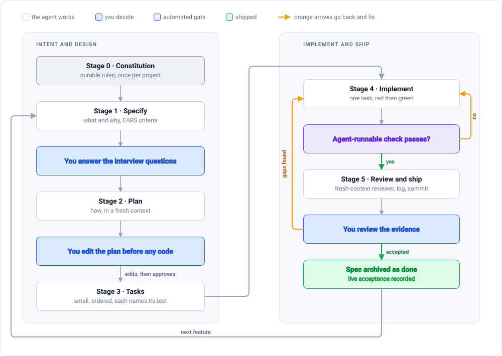
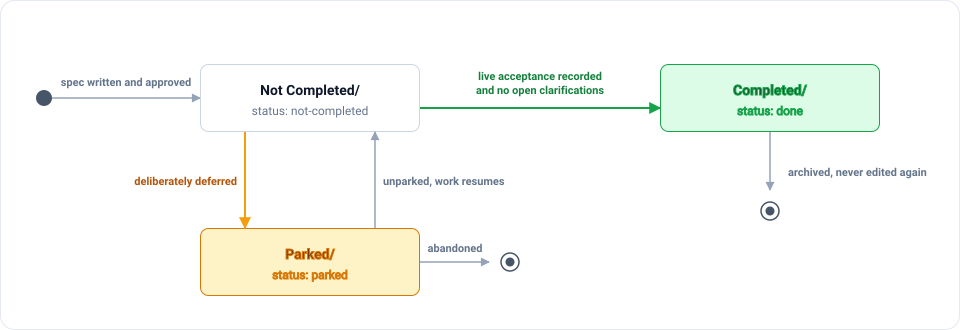

# METHOD

**Spec-driven agentic development: a complete, opinionated workflow for building software with coding agents.**

The claim of this document is narrow and testable: the difference between an agent run you have to babysit and an agent run you can walk away from is *whether the agent has a check it can run itself*. Everything else in this method exists to make that check possible, meaningful, and cheap to write.

This is not a tool. It is a sequence of artifacts, a vocabulary for the states those artifacts can be in, and a set of prompts that reliably produce them.

---

## 1. Match the rigor to the stakes

There is a spectrum, and the correct answer is to sit at the right point on it rather than to always apply the heaviest process.

```
LOW RIGOR ----------------------------------------------> HIGH RIGOR

Vibe coding             Lightweight              Spec-driven development
"build me X and          "small change,           "constitution, spec, plan,
 see what happens"        describe the diff        tasks, implement, review,
                          in one sentence"         ship"

Throwaway, spikes,      Typos, log lines,        Real features, commercial
weekend prototypes      renames, 1-file fixes    products, anything maintained
```

"Vibe coding" was coined by Andrej Karpathy for *throwaway weekend projects*, and he explicitly scoped it **outside** production systems. By 2026 the framing had shifted again, to what Karpathy described as *"the age of agentic engineering ... orchestrating agents against detailed specifications with human oversight"* ([Augment Code, 2026](https://www.augmentcode.com/guides/vibe-coding-vs-spec-driven-development)).

The trap in the other direction is real too. Anthropic is explicit: *"If you could describe the diff in one sentence, skip the plan"* ([Best practices for Claude Code](https://code.claude.com/docs/en/best-practices)). Full ceremony on a one-line fix is not discipline, it is waste, and it teaches the team to route around the process.

**Rule of thumb:** if the change will be maintained by someone who is not in the room right now, it gets a spec.

---

## 2. Four independent sources, one workflow

The field converged. Four groups, working separately, describe close to the same artifact chain.

| Source | Their name for it | Artifacts |
|---|---|---|
| [GitHub Spec Kit](https://github.com/github/spec-kit) | Spec-Driven Development | constitution, spec, plan, tasks, implement |
| [AWS Kiro](https://kiro.dev/docs/specs/) | Spec-driven / agentic engineering | requirements, design, tasks |
| [Harper Reed](https://harper.blog/2025/02/16/my-llm-codegen-workflow-atm/) | LLM codegen workflow | `spec.md`, `prompt_plan.md`, `todo.md` |
| [Anthropic (Claude Code)](https://code.claude.com/docs/en/best-practices) | Explore, Plan, Code, Commit | `CLAUDE.md` plus spec, plan, tests |

The convergence is the evidence. Nobody coordinated this; the shape is forced by the constraint described in section 8.

---

## 3. The loop

Stage 0 runs once per project. Stages 1 through 5 repeat per feature.



Note where the human appears: three times, all of them cheap. Answering an interview, editing a plan, and reading evidence. The human is deliberately absent from the implement loop, because that is the loop that runs dozens of times and the one whose cost compounds.

---

## 4. Stage 0: Constitution

**Produces:** a small set of durable, always-loaded rules. In practice this is `CLAUDE.md` or `AGENTS.md` for agent behavior, plus an `ARCHITECTURE.md` for module responsibilities and the things that must never change, plus a decision log (`DECISIONS.md`) that grows over the life of the project.

**Why it exists:** every feature-level document assumes a set of constraints. If those constraints are not written down once, they get re-litigated per feature, inconsistently, and the agent silently picks a different answer each time.

**The failure mode it prevents:** stack drift and taboo violations. The agent introduces a framework in feature 7 that feature 3 was explicitly built to avoid, and nobody notices until the bundle doubles.

**The failure mode it can cause if done badly:** a bloated constitution is worse than a thin one. *"If your CLAUDE.md is too long, Claude ignores half of it because important rules get lost in the noise."* Anthropic's operational test is the right one: for each line, ask *"would removing this cause a mistake?"* If the honest answer is no, cut it or move it into a skill that loads on demand.

**What belongs in it:** identity and commercial status, naming taboos, hard stack constraints, security boundaries (which keys may appear client-side and which never may), testing rules, commit conventions, and the project-wide definition of done.

**What does not:** anything that is true of one feature. Anything you would have to read twice to apply. Long explanatory prose. Those go in architecture docs or skills.

**Prompt:**

```
Read the codebase and produce a constitution at CLAUDE.md.
Include only rules that change how an agent behaves: stack constraints,
security boundaries, naming taboos, testing rules, commit conventions.
Target 200 lines or fewer. For every line you write, be able to answer
"would removing this cause a mistake?" with yes.
Put anything that is only sometimes relevant into a separate file and
reference it by path instead of inlining it.
```

Template: [`templates/00-constitution.example.md`](templates/00-constitution.example.md) and [`templates/CLAUDE.md.example`](templates/CLAUDE.md.example).

---

## 5. Stage 1: Specify

**Produces:** `specs/<feature-name>/spec.md`. User stories, acceptance criteria in a testable format, an explicit out-of-scope list, edge cases, and an end-to-end definition of done. No technology decisions at all.

**Why it exists:** the most expensive agent failure is not a bug, it is a correct implementation of the wrong thing. That failure is only catchable before code exists.

**The failure mode it prevents:** the five-round correction spiral, where each round burns context and each correction is a partial description of a requirement that was never written down.

### Let the agent interview you

The single most effective technique for producing a good spec is to invert who is asking the questions. Anthropic's recommended prompt:

> *"I want to build [X]. Interview me in detail using the AskUserQuestion tool. Ask about technical implementation, UI/UX, edge cases, concerns, and tradeoffs. Don't ask obvious questions, dig into the hard parts I might not have considered. Keep interviewing until we've covered everything, then write a complete spec to SPEC.md."*

Harper Reed arrives at the same trick from a different direction: *"Ask me one question at a time so we can develop a thorough, step-by-step spec."*

This front-loads the ambiguity that otherwise surfaces as correction rounds during implementation, when it is at its most expensive.

### Write acceptance criteria in EARS

EARS (Easy Approach to Requirements Syntax) is the format Kiro and Spec Kit both use. Every criterion is one line, and every line is one test.

```
AC-1: WHEN the import queue is empty, the system SHALL disable the SUBMIT button.
AC-2: WHEN an incoming record has no matching owner, the system SHALL discard the
      record AND SHALL NOT create an owner.
AC-3: WHILE a sync is in flight, WHEN the user navigates away, the system SHALL
      cancel the in-flight request.
```

The value is mechanical: the mapping from requirement to test stops living in someone's head. "Is this feature done?" becomes a query, not a judgment call. This is the bridge between prose specs and a measurable test suite that actually tracks requirements.

### Mark real ambiguity, do not resolve it silently

Genuine unknowns are written inline as `[NEEDS CLARIFICATION: which timezone do stored timestamps use?]`. This is not a TODO. It is a hard stop: **finding one mid-implementation means stopping to ask, not guessing.** A spec cannot be marked done while one survives in it, and that rule is enforceable by a linter (see [`docs/CASE-STUDY-B.md`](docs/CASE-STUDY-B.md)).

The reason to write it down rather than ask immediately is that ambiguity discovered during planning is cheap to batch. The reason to block on it during implementation is that a guess made at that point gets baked into code and tests simultaneously, and both will agree with each other forever.

**Prompt:**

```
I want to build <one-line description>. Interview me in detail.
Ask about behavior, UI/UX, edge cases, failure modes, and tradeoffs.
Dig into the hard parts I might not have considered. Don't ask obvious
questions. Keep interviewing until we have covered everything, then write
specs/<feature>/spec.md with acceptance criteria in EARS (WHEN ... SHALL ...)
format, numbered AC-1 onward, plus an explicit out-of-scope list.
Mark anything genuinely ambiguous as [NEEDS CLARIFICATION: ...] instead of
choosing for me.
```

Template: [`templates/01-spec.template.md`](templates/01-spec.template.md).

---

## 6. Stage 2: Plan

**Produces:** `specs/<feature-name>/plan.md`. Files touched, interfaces and signatures, data model changes, load order, edge-case handling strategy, and rationale for every non-obvious choice.

**Why it exists:** this is the cheapest intervention point in the entire method. Editing a plan costs a sentence. Reverting code costs a session.

**The failure mode it prevents:** *"Letting Claude jump straight to coding can produce code that solves the wrong problem"* ([Anthropic](https://code.claude.com/docs/en/best-practices)). Read first, plan second, code third.

Two operational rules:

1. **Produce the plan in plan mode or a fresh context.** The agent that just interviewed you is carrying the whole conversation. A plan written from the spec alone is a test of whether the spec is sufficient.
2. **A human reads and edits it before a line of code is written.** If this step is skipped the method degrades into vibe coding with extra paperwork.

The rationale section is not decoration. Missing rationale is the documented reason specs rot: future readers cannot tell which constraints are load-bearing and which were arbitrary, so they preserve all of them or none of them. Architecture Decision Records exist for exactly this, and the teams that keep them are the ones whose specs survive.

**Prompt:**

```
Read specs/<feature>/spec.md and the constitution and architecture docs.
In plan mode, produce specs/<feature>/plan.md: files touched, interfaces and
exact signatures, data and state changes, edge-case handling mapped to the
spec's edge cases, and rationale for every non-obvious choice.
Do not write code. If anything in the spec is ambiguous, list it and stop
rather than planning around it.
```

Template: [`templates/02-plan.template.md`](templates/02-plan.template.md).

---

## 7. Stage 3: Tasks

**Produces:** `specs/<feature-name>/tasks.md`. A numbered, dependency-ordered checklist. Each task names the exact files it touches and the exact test that proves it.

**Why it exists:** an agent given a whole feature will produce a large diff that is verifiable only in aggregate. An agent given one task produces a diff you can reject in ten seconds.

**The failure mode it prevents:** orphaned code. Harper Reed's rule is the sharpest statement of it: *"break it into small, iterative chunks"*, *"no orphaned code"*, *"each prompt must integrate into previous work"*, and *"aggressive tracking of progress against documentation to prevent accumulating uncompleted dependencies."*

Spec Kit marks parallelizable tasks `[P]`. Kiro builds a dependency graph and runs independent tasks in waves. Neither is required. A numbered, dependency-ordered checklist where independent items are flagged is enough, and it is legible to a human, which the dependency graph is not.

One task, one acceptance criterion (or a small set), one test file, one commit. If a task cannot name its test, the task is not yet a task, it is a wish.

**Prompt:**

```
Read specs/<feature>/spec.md and plan.md. Produce specs/<feature>/tasks.md:
small, dependency-ordered tasks. Each task must name the acceptance criteria
it implements, the exact files it touches, and the test file that proves it.
Mark tasks that are independent of all others with [P].
No task may leave code that nothing calls.
End with a final task: full regression plus fresh-context review.
```

Template: [`templates/03-tasks.template.md`](templates/03-tasks.template.md).

---

## 8. Stage 4: Implement

**Produces:** working code, and a test per acceptance criterion, added in that order.

**Why it exists:** this is the only stage that changes the product. Everything before it is preparation for making this stage unsupervised.

### The central argument: give the agent a check it can run

This is the highest-leverage practice in the entire method, and the reason the other five stages are worth their cost.

> *"Claude stops when the work looks done. Without a check it can run, 'looks done' is the only signal available, and you become the verification loop... Give Claude something that produces a pass or fail, and the loop closes on its own."*
> ([Anthropic, Best practices for Claude Code](https://code.claude.com/docs/en/best-practices))

Read that as a statement about who is doing the work. An agent without a self-runnable check does not stop when the work is correct. It stops when the work *resembles* correct work, because resemblance is the only signal it has. The gap between those two conditions is filled by a human reading diffs. That human is the verification loop, and a verification loop made of a human does not scale, does not run at 2am, and gets less careful the tenth time it runs that day.

A check is anything that returns pass or fail without a human interpreting it: a test suite, a build, a type check, a linter, a schema validator, a screenshot diff, a script that greps the diff for a forbidden string.

### Escalate how hard the check gates the stop

In increasing order of strength:

1. **In-prompt instruction.** "Run the tests after implementing and fix any failures." Works most of the time. Fails exactly when you are not watching.
2. **A goal condition.** A separate evaluator re-checks after every turn and keeps the turn going until the condition holds. Stronger, because the checker is not the same process as the implementer.
3. **A Stop hook.** A script that blocks the turn from ending until the suite passes. Deterministic, runs every time, has no opinion, cannot be talked out of it.

Level 3 is the goal. It is the difference between a workflow that depends on the agent's cooperation and one that does not. See [`enforcement/README.md`](enforcement/README.md) for a working example.

### The corollary: a check that cannot run is a hole in your confidence

A suite where a subset silently does not execute in the agent's environment (browser tests that need a live third-party script, integration tests that need credentials) is worse than no suite, because green now means "the parts that ran, ran." Either make those tests executable in the agent's sandbox (mock the dependency, force the state directly) or make their absence loud.

### Test first, then implement

For each task: write the failing test from the acceptance criterion, run it, confirm it fails for the right reason, then implement until it passes. Test-driven development was always good practice; with agents it is a force multiplier, because the test is the self-verification signal that makes the previous section possible.

The research converges here too. Eval-driven development ([Red Hat](https://developers.redhat.com/articles/2026/03/23/eval-driven-development-build-evaluate-ai-agents)), test-driven agent development ([Fireworks](https://fireworks.ai/blog/test-driven-agent-development)), and the [TDAD paper](https://arxiv.org/html/2603.17973v1) all land on the same three steps: define quantifiable acceptance criteria, make them executable, let the agent iterate until green.

### Context hygiene

One feature per session. Clear the context between unrelated tasks. After two failed corrections of the same thing, stop correcting and restart with a better prompt, because the failed attempts are now in the context and are actively making the next attempt worse.

**Prompt:**

```
Implement task T<n> from specs/<feature>/tasks.md.
1. Write the test first, from the acceptance criterion. Run it. Confirm it
   fails, and that it fails for the reason you expect.
2. Implement the smallest change that makes it pass.
3. Run the test and the affected suite. Show me the actual output.
4. Do not touch any file outside this task's list.
Stop and report when the test is green.
```

---

## 9. Stage 5: Review and ship

**Produces:** an independent verdict on the diff, a green full suite, a recorded decision, and a commit.

**Why it exists:** the agent that wrote the code is the worst possible reviewer of it. It is carrying every justification it invented along the way.

### Adversarial review in a fresh context

Spin up a reviewer that sees only the diff and the spec, never the reasoning that produced them. A model that did not write the code has no stake in it.

> *"Use a subagent to review the diff against spec.md. Check that every acceptance criterion is implemented, the listed edge cases have tests, and nothing outside scope changed. Report only gaps that affect correctness or the stated requirements."*

### The warning attached to that prompt

Note the last sentence, because it is load-bearing and it is the part people drop. **A reviewer told to find gaps will find them whether or not they exist.** Asked an open question, a model will produce defensive error handling for impossible inputs, tests for states the type system already excludes, and abstraction layers for a second implementation that will never be written. The output looks like diligence and is actually over-engineering with a review-shaped label on it.

Scope the reviewer to correctness and to the stated requirements. "Report only gaps that affect correctness or the stated requirements" is not politeness, it is the constraint that makes the review worth running.

### Then record, and only then ship

1. Run the full suite and show the output as evidence. Not a claim of success, the actual output.
2. Record rationale in the decision log: what was chosen, what was rejected, why, and the date.
3. Record **live acceptance** on the spec: what was actually observed when the feature ran for real. Real command output, real generated artifacts, real numbers. Not a restatement of the acceptance criteria in the past tense.
4. Mark the spec done and archive it.
5. Commit with a descriptive message, and open the PR.

Step 3 is the one most methods omit and the one that carries the most weight:

> **A spec is not done when the code is written. It is done when its live acceptance is real.**

A restatement of criteria proves nothing; anyone can write "AC-4 verified." Pasted real output cannot be produced without having run the thing.

---

## 10. Spec states: the folder is the state

A spec is in exactly one of three states, and there is no fourth.



Two rules make this work:

- **The folder is the state.** A spec's location on disk and its frontmatter `status:` must agree. Anything else means the state is a matter of opinion, and opinions drift. A linter enforcing the agreement makes the state a fact.
- **A done spec is archived, not maintained.** The number one documented failure of spec-driven development is documentation drift: *"updating the code is much easier than updating the spec first,"* so over time the code, the spec, and everyone's mental model diverge. A per-feature spec that is finished and closed cannot drift, because nobody edits it. A global mega-document that is edited forever will drift, guaranteed, and its drift is invisible.

There is deliberately no "in progress" state. A spec being worked on is `not-completed`, exactly like one nobody has touched. This is not an oversight: "in progress" is the state that quietly holds work for six months.

---

## 11. What the evidence supports

1. **Context is the scarce resource.** *"Most best practices are based on one constraint: the context window fills up fast, and performance degrades as it fills"* ([Anthropic, Effective context engineering](https://www.anthropic.com/engineering/effective-context-engineering-for-ai-agents)). Every other practice here is downstream of this: a short constitution, clearing between tasks, subagents for exploration, one feature per session, per-feature specs instead of one growing document.
2. **Separating research and planning from implementation works.** Universal across all four sources. The plan is where "solving the wrong problem" gets caught for pennies.
3. **A self-runnable check converts babysitting into walking away.** Section 8. The single highest-leverage change available to most teams.
4. **Tests derived from acceptance criteria are the bridge to a measurable suite.** The whole eval-driven and test-driven-agent literature agrees on the mechanism.
5. **Independent review beats self-review.** A fresh model is not biased toward code it did not write. Writer and reviewer in separate sessions is a named, reproducible pattern.
6. **Decision logs prevent re-litigation.** They are the most commonly skipped artifact and the one most correlated with specs that are still useful a year later.

## 12. What fails

1. **Documentation drift.** The number one documented failure. Mitigation: archive per-feature specs; make "update the decision log" part of shipping, every time.
2. **Missing rationale.** Specs record *what*, rarely *why*. Future readers cannot tell load-bearing constraints from arbitrary ones. Mitigation: a rationale section in every plan, promoted to an ADR on ship.
3. **Over-specification and over-engineering.** Reviewers asked for gaps invent them; agents write defensive code for impossible cases. Mitigation: smallest safe change, and reviews scoped to correctness only.
4. **A bloated always-loaded constitution.** Gets half-ignored. Mitigation: prune ruthlessly, move occasional knowledge to on-demand skills.
5. **The kitchen-sink session and the correction spiral.** Unrelated tasks in one context, or correcting the same thing three times, poison the context for everything after. Mitigation: clear between tasks; after two failed corrections, restart with a better prompt.
6. **A check that cannot actually run.** Green that means "the subset that executed, executed." Mitigation: make every test runnable in the agent's environment, or make its absence fail loudly.

---

## 13. Where to go next

- [`templates/`](templates/) contains the copy-paste artifacts for every stage, plus a one-page loop checklist and a worked example.
- [`docs/CASE-STUDY-A.md`](docs/CASE-STUDY-A.md) examines a real project that arrived at roughly 80% of this method by instinct, with a document-by-document scorecard and the five upgrades that closed the gap.
- [`docs/CASE-STUDY-B.md`](docs/CASE-STUDY-B.md) is the payoff: the same method after it was made enforceable in code, with a linter that fails the build when a spec lies about its own state.
- [`enforcement/`](enforcement/) contains that linter and instructions for wiring it as a pre-commit hook and as an agent Stop hook.
- [`docs/SOURCES.md`](docs/SOURCES.md) lists every external source with the claim it supports.
