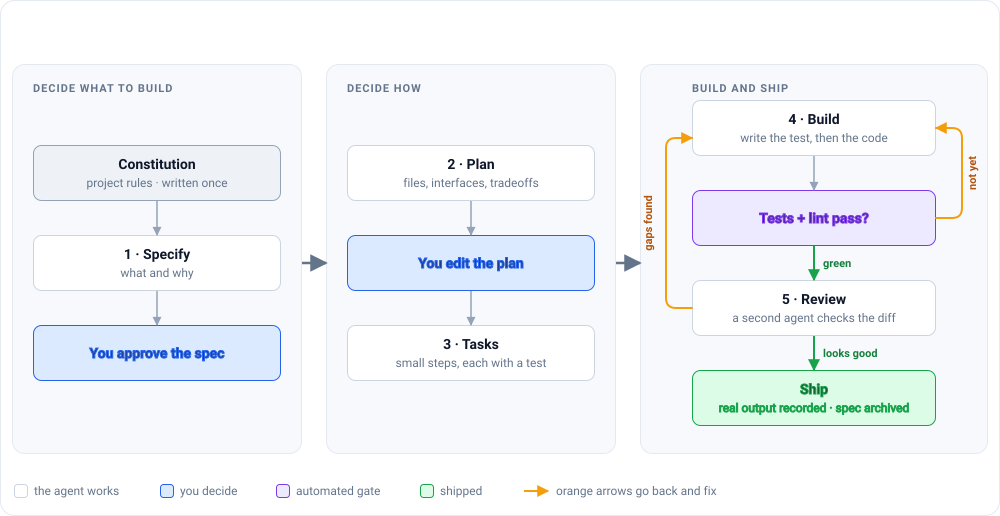
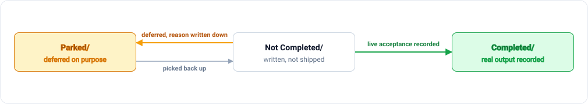

# Spec-Driven Agentic Development

Coding agents stop when the work *looks* done, not when it's actually verified, and past a few features that makes you the one checking their work by hand. This repo packages a stage-by-stage spec-driven workflow (constitution → spec → plan → tasks → build → review) together with a linter that enforces it, so "done" means real observed output instead of a claim. It's Markdown templates plus one zero-dependency Node.js script: no framework, no install step, MIT licensed.

---

## 🛠️ The Toolkit

This isn't an app, so there's no frontend/backend split. The "stack" is deliberately small:

* **Specs:** Markdown + YAML frontmatter (chosen so they're diffable in a PR and readable without tooling)
* **Linter:** [`enforcement/lint.mjs`](enforcement/lint.mjs): Node.js 16+, zero dependencies (chosen so it runs anywhere with no install step and is safe to drop into any repo)
* **Enforcement point:** the same script wired three ways: a pre-commit hook, a CI step, and an agent Stop hook (chosen so the check runs whether a human or an agent is the one finishing the turn)

---

## The loop at a glance



You show up twice, both times cheaply: approve the spec, then edit the plan. Everything in the third band runs without you, because that's the part that repeats dozens of times per feature. When a spec ships, the next one starts back at stage 1.

**[Read the full method →](METHOD.md)**

---

## 📈 System Architecture & Engineering Decisions

### Is any of this new?

Mostly no, and I'd rather say that up front than oversell it.

The stage chain (constitution, spec, plan, tasks, implement) is what [GitHub Spec Kit](https://github.com/github/spec-kit), [AWS Kiro](https://kiro.dev/docs/specs/), [Harper Reed's workflow](https://harper.blog/2025/02/16/my-llm-codegen-workflow-atm/), and [Anthropic's Claude Code guidance](https://code.claude.com/docs/en/best-practices) all converged on separately. EARS acceptance criteria come from requirements engineering. Test-first comes from TDD. None of that is mine.

What I haven't seen packaged together anywhere else is the enforcement layer:

| | Common in other spec-driven guides | What this repo adds |
|---|---|---|
| **Spec status** | A `status:` field someone remembers to update | The folder *is* the status. `Completed/`, `Not Completed/`, `Parked/`. The linter fails when the folder and the frontmatter disagree, so a spec can't quietly lie about itself. |
| **Definition of done** | The acceptance criteria are checked off | A `## Live acceptance` section holding **real observed output**: actual terminal text, actual numbers. "AC-4 verified" is a sentence anyone can type; a pasted run isn't. The linter blocks `done` without it. |
| **Who runs the checks** | The prompt asks the agent to check its work | The same linter runs as an agent **Stop hook**. A non-zero exit blocks the turn from ending. The agent can't decide it's finished. |
| **Ambiguity** | Resolved by whoever notices | `[NEEDS CLARIFICATION: ...]` is a stop-and-ask marker, and a spec can't be marked done while one survives in it. |

So the honest claim is narrow: **the workflow is borrowed and the enforcement is the contribution.** Convention is one tired Friday away from being false; an exit code isn't.

### Key bottleneck solved

**The problem:** a spec's `done` status is easy to fake. Someone types `status: done`, moves on, and nothing checks whether the feature was ever actually verified. Status and reality drift apart exactly when it's most expensive: late, under deadline pressure.

**The solution:** two checks close that gap. A spec's folder has to agree with its `status:` frontmatter, so it can't claim `done` while still sitting in `Not Completed/`. And a `done` spec must carry a `## Live acceptance` section with real observed output, not a checked box. Both run from an agent Stop hook, so the turn can't end until they pass. Full reasoning for both in [enforcement/README.md](enforcement/README.md#what-it-enforces).

---

## ⚡ Quick Start & Prerequisites

**Prerequisites:** Node.js 16+ and git. No install step, no `package.json` to add.

```bash
# Once per project
cp templates/00-constitution.example.md  ./CONSTITUTION.md
cp templates/CLAUDE.md.example           ./CLAUDE.md

# Once per feature
mkdir -p specs/my-feature
cp templates/01-spec.template.md   specs/my-feature/spec.md
cp templates/02-plan.template.md   specs/my-feature/plan.md
cp templates/03-tasks.template.md  specs/my-feature/tasks.md

# Before you commit, and from your agent's Stop hook
node enforcement/lint.mjs
```

If you only read one file, make it [templates/04-feature-loop-checklist.md](templates/04-feature-loop-checklist.md). It's one page and it's the whole method.

---

## How a spec moves

Three states, and the folder it sits in *is* the state, so there's never a second opinion to reconcile.



Once a spec reaches `Completed/` it is archived and never edited again, which is why it cannot drift out of date.

There's deliberately no "in progress." A spec being actively worked on and one nobody has opened look identical from the outside, and "in progress" is the state that quietly holds work for six months.

---

## 🧪 Testing

There's no application code here, so there's no coverage percentage to quote. This repo *is* the linter plus the templates it checks. What "testing" means here is testing the linter itself against real specs:

* **Run it:** `node enforcement/lint.mjs`
* **What it checks:** 11 rules, including frontmatter completeness, folder/status agreement, live acceptance on every `done` spec, and no lingering `[NEEDS CLARIFICATION]` markers. Full table in [enforcement/README.md](enforcement/README.md#what-it-enforces).
* **Where it's been run for real:** against the 8 specs in [Case Study B](docs/CASE-STUDY-B.md).
* **What it can't check:** that the live-acceptance evidence is *true*, only that it's *present*. That part's still on a human, not the linter.
