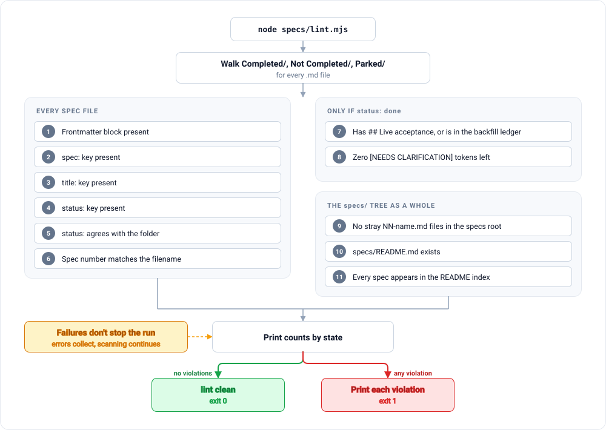

# Case Study B: the method, enforced in code

**Subject:** ResumeGraph, the author's own project. A local, type-safe multi-agent system that tailors resumes and cover letters against a target job description, orchestrated with LangGraph in Python against a locally hosted inference cluster.

**Why it matters here:** [`CASE-STUDY-A.md`](CASE-STUDY-A.md) describes a project that arrived at most of spec-driven development by instinct and stopped short of enforcement. This is the same method after enforcement was added, in the only form that actually holds: a script that exits non-zero.

Eight specs were built and closed under this system, in a strict phase order, each one implementable by a fresh agent with no memory of the previous phases. That last property is the real test. If a spec set can be handed to an agent that has never seen the project and still produce the right code, the specs are load-bearing. If it cannot, the specs were decoration and the knowledge was living in someone's head.

---

## 1. The vocabulary is the invariant part

Three states, and no fourth:

**`done`** · **`not-completed`** · **`parked`**

Not "in progress." Not "blocked." Not "in review." Every one of those is a variant of `not-completed` that exists to make a stalled thing feel like a moving thing. A spec someone is actively writing code for and a spec nobody has opened are in the same state, because from the outside they are indistinguishable, and the only honest report is the one that treats them identically.

### The folder is the state

This is the rule that makes the vocabulary enforceable rather than aspirational.

```
specs/
  Completed/       <- every file here has status: done
  Not Completed/   <- every file here has status: not-completed
  Parked/          <- every file here has status: parked
  README.md        <- the living index
  lint.mjs
```

Frontmatter `status:` and folder location must agree. If they disagree, the lint fails and tells you to move the file or fix the frontmatter. There is no third opinion to consult, because there is no third place the state is written.

The reason this works is subtle. Every documentation system decays through the same mechanism: the description and the thing described are stored separately, so they can disagree, and disagreeing is free. Making the folder the state removes the separation for the one attribute that matters most. Moving a file is an act you cannot perform by accident and cannot forget you performed.


Note the transition label into `done`. It is not "code written."

---

## 2. Live acceptance: the rule that carries the most weight

> **A spec is not done when the code is written. It is done when its live acceptance is real.**

Every spec in `Completed/` must carry a `## Live acceptance` section, and that section must record **what was actually observed**: real command output, real generated text, real measured numbers. Not a restatement of the acceptance criteria in the past tense.

The distinction is the entire point. "AC-4 verified" is a sentence anyone can type, including an agent that believes it is true. A pasted calibration table showing 212 false positives reduced to 0 across three consumption passes, or a recorded page count dropping 7, 4, 3, 3, 2 across four real iterations, cannot be produced without having run the thing. The first is a claim. The second is evidence, and evidence is not forgeable by an agent that merely thinks it succeeded.

The rule also changes what happens *during* implementation. Knowing that the spec cannot close without real output makes the agent run the real thing early, which is when the interesting failures surface: a character-encoding crash on one console's default code page, a duplicated header because two components each thought they owned it, a boundary-matching bug that silently mishandled every term beginning or ending in punctuation. None of those were findable by reading code. All of them were found by the requirement to produce real output before closing.

The lint permits exactly one escape hatch, and it is deliberately awkward: a done spec with no live acceptance passes only if it is listed under a "Pending backfill" heading in `backfill-ledger.md`. That is tracked debt rather than hidden debt. Writing your spec's name into a ledger of things you have not really verified is a small, appropriate humiliation, and the ledger is readable by anyone.

---

## 3. `[NEEDS CLARIFICATION: ...]` and the obligation to stop

Genuine ambiguity is written inline, in the spec, as:

```
[NEEDS CLARIFICATION: should keyword weighting be a separate state field
or derived at read time?]
```

Two rules attach to that marker.

**Finding one mid-implementation means stopping to ask, not guessing.** This is the expensive half. An agent that guesses at that moment does not merely write wrong code, it writes wrong code *and a passing test that agrees with it*. The wrong answer becomes self-certifying, and the mistake is now protected by the same mechanism that was supposed to catch it. Stopping costs one message. Not stopping costs a rewrite plus the loss of trust in the suite.

**A done spec may not contain one.** The lint enforces it. This closes the obvious loophole where a question gets marked resolved by being scrolled past.

In practice both kinds of clarification occurred in this project and both were resolved by the owner rather than the agent. One concerned the shape of a state field; the other was a mid-implementation proposal to fix a layout problem using a document feature that an earlier spec had structurally prohibited. The agent surfaced it instead of quietly using the feature. The owner rejected the proposal and a different technique was used. That is exactly the trade the rule is designed to buy: one interruption, in exchange for not silently violating a constraint that an earlier spec had spent effort making structural.

---

## 4. The required six-section shape

Every spec has the same six sections, in the same order:

| Section | What it holds |
|---|---|
| `## 1 Why now` | The problem, and why it is worth solving at this point rather than later. |
| `## 2 What` | The behavior, including an `### OUT of scope` list that is explicitly load-bearing. |
| `## 3 Design` | The technical approach. |
| `## 4 Implementation plan` | The ordered steps. |
| `## 5 Acceptance criteria` | Each one independently checkable. |
| `## 6 Status` | State, dates, and (once done) the live acceptance record. |

Two of these do unusual work.

**The out-of-scope list is load-bearing, not informational.** In this project each spec's out-of-scope list names the *next* phase's work by name. The effect is that an agent getting a head start on later work is committing a visible scope violation rather than being helpful. Without that, "I also went ahead and implemented the next part" reads as initiative, and the reviewer has no written basis for rejecting it.

**"Why now" prevents specs that are solutions looking for problems.** A spec that cannot articulate why it is being done at this moment is usually a preference, and preferences do not survive contact with a later reader asking why the code is shaped this way.

The build order was treated as non-negotiable for the same reason: the specs are one chronological execution path, not an independent backlog. Later enhancement specs relax this, but relax it explicitly, by naming which prior specs they depend on rather than assuming a new linear chain.

---

## 5. Two structural constraints, and why "structural" is the operative word

This project's two hardest rules are both stated as structure rather than instruction, and the distinction generalizes well beyond this codebase.

**Zero fabrication is structural.** A single data file is the sole factual authority. No agent may introduce a tool, metric, employer, date, title, or credential that is not in it, and no code path anywhere writes to it. The strongest form of the rule is **injection over instruction**: the immutable facts are written into the output by ordinary code, read straight from the authority file, and are *absent from every model response schema*. The model is not told to be honest about them; it is not given the opportunity to be otherwise. The test for whether this was implemented correctly is a prompt-independence check: delete the honesty rule from the prompt, run it again, and the facts must still be right.

The rule has two sides. An allow-list holds every term that may appear. A deny-list holds terms already examined and ruled out, each paired with the honest adjacent framing that should be used instead. The deny-list exists because a keyword in the target job description is exactly the thing a helpful model bridges to, and because a low score on a skill the candidate genuinely lacks is the correct outcome rather than a defect to tune away.

The deny-list also encodes a lesson worth stating generally: **a fabricated technology claim is catastrophic in a live interview.** Not embarrassing, catastrophic, because it is discovered by a person who now has to reassess everything else on the page. The asymmetry is total. A missing keyword costs a filter match. A fabricated one costs the candidate's credibility in the room. Any system that generates claims on someone's behalf needs a deny-list for exactly this reason, and it needs to be a list of specific terms, not a general instruction to be truthful.

**Layout safety is structural.** The document compiler must contain no code path capable of emitting a table, a column, a text box, a tab-aligned pair, or an image. The reasoning is stated in the spec itself and is the cleanest one-line argument for structural rules anywhere in this repository:

> "We don't use tables" enforced by convention is one refactor away from being false. "The module never imports `add_table`" is checkable with grep.

Verification followed the same principle. The output documents were checked not with the library that produced them but independently, by unzipping the file and parsing its XML directly, counting table elements and confirming no content was silently dropped. A verifier that shares a dependency with the thing it verifies is checking that the dependency is self-consistent.

---

## 6. The linter: eleven checks

`lint.mjs` has no dependencies, never writes, and exits 1 on any violation. Run it after any status or folder change.

```bash
node specs/lint.mjs
```



Every check, and exactly what makes it fail:

| # | Check | Fails when |
|---|---|---|
| 1 | **Frontmatter block exists** | The file does not open with a `---` fenced YAML block. Reported as `missing frontmatter block`, and the file is skipped for all remaining per-file checks, because without frontmatter there is nothing to compare against. |
| 2 | **`spec:` key present** | The frontmatter has no `spec:` line. The spec number is what ties a file to its index row and its filename. |
| 3 | **`title:` key present** | The frontmatter has no `title:` line. |
| 4 | **`status:` key present** | The frontmatter has no `status:` line. Without it the file has no declared state to compare against its folder. |
| 5 | **`status:` agrees with the folder** | A file in `Completed/` says anything other than `done`, a file in `Not Completed/` anything other than `not-completed`, or a file in `Parked/` anything other than `parked`. The error names both values and tells you to move the file or fix the frontmatter. This is the folder-is-the-state rule made mechanical. |
| 6 | **Spec number matches the filename** | Frontmatter says `spec: 8` but the file is not named `08-something.md`. The number is zero-padded to two digits and must be the filename prefix. Catches copy-paste spec creation, which is how duplicate numbers get into an index. |
| 7 | **A `done` spec has live acceptance** | A file with `status: done` has no `## Live acceptance` heading **and** is not named under the `## Pending backfill` heading of `backfill-ledger.md`. The ledger check matches either the exact filename or the spec number. This is the "done means observed, not written" rule. |
| 8 | **A `done` spec has no open clarifications** | A file with `status: done` still contains one or more `[NEEDS CLARIFICATION: ...]` tokens. The error reports the count. A spec cannot be finished while it still admits it does not know something. |
| 9 | **No stray specs in the root** | Any file in `specs/` itself matches `NN-name.md`. A spec sitting in the root has no folder, and therefore no state. Catches the most common real mistake: creating a new spec next to the README instead of inside `Not Completed/`. |
| 10 | **The index exists** | `specs/README.md` is missing. The README is the living index, and its absence means there is no single place that lists what exists. |
| 11 | **Every spec is in the index** | A spec file's name does not appear anywhere in `README.md`. Catches orphaned specs: real work, real file, invisible to anyone reading the index. Note the direction of this check. It finds specs missing from the index, not index rows pointing at deleted specs. |

The lint always prints a summary count first, so a run is informative even when clean.

**A clean run:**

```
specs: 8 (done 8 · not-completed 0 · parked 0)
lint clean
```

Exit code 0.

**A failing run:**

```
specs: 8 (done 7 · not-completed 1 · parked 0)

3 problem(s):
  ✗ Completed/05-graph-compilation-routing.md: status 'not-completed' disagrees with folder (expected 'done'), move the file or fix the frontmatter
  ✗ Completed/07-resume-curation-page-budget.md: done but still carries 1 [NEEDS CLARIFICATION] token(s)
  ✗ Not Completed/09-new-thing.md: not linked from README.md index
```

Exit code 1.

All violations are collected before exiting, so one run tells you everything rather than making you play whack-a-mole. And the script never writes: it will not "helpfully" move your file or edit your frontmatter, because a linter that repairs state is a linter you stop reading.

---

## 7. What this actually bought

The eight specs in this project were each implementable by an agent with no memory of the previous ones. That was possible because the state of every spec was a fact on disk rather than a belief, because a done spec carried real observed output rather than a claim, and because an ambiguity the agent could not resolve was a stop condition rather than a coin flip.

The generalizable form is short:

- **Instinct produces the artifacts.** Case Study A got most of the way there without ever reading a methodology.
- **Only code produces the guarantee.** Eleven checks, no dependencies, one exit code.
- **The check must be runnable by the agent, not just by you.** See [`../enforcement/README.md`](../enforcement/README.md) for wiring it as a pre-commit hook and as an agent Stop hook, which is what closes the loop without a human standing in it.
